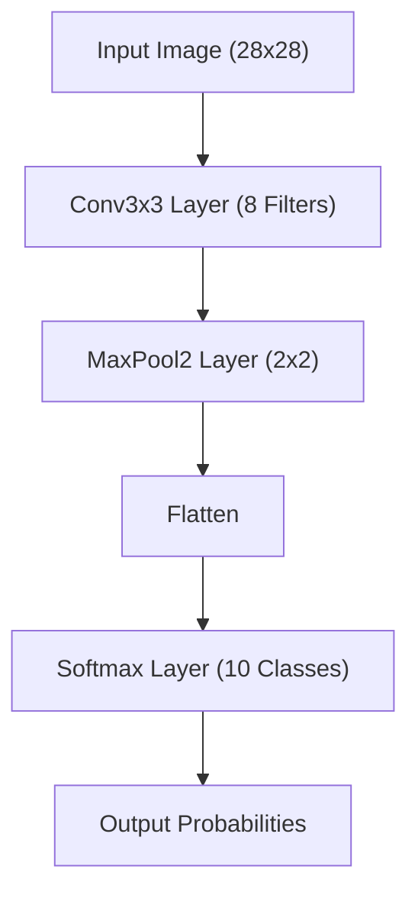
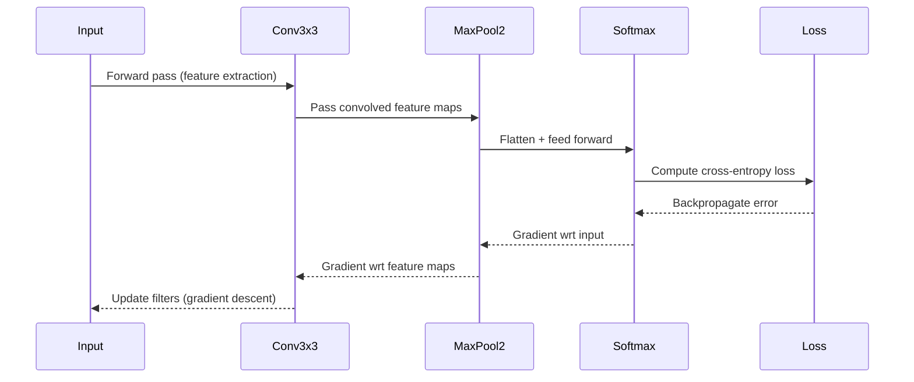

# 🧠 Simple CNN from Scratch (NumPy)

This project demonstrates how to build and train a **Convolutional Neural Network (CNN)** entirely from scratch using **NumPy**, without using any deep learning frameworks like TensorFlow or PyTorch. It trains a small CNN on the **MNIST handwritten digit dataset** (28×28 grayscale images).

---

## 📘 Overview

This project helps you understand the **core building blocks** of a CNN, including:

- Convolutional layers
- Max Pooling layers
- Softmax output layers
- Forward and backward propagation (gradient updates)
- Loss and accuracy computation

It’s a great resource for those who want to see **how CNNs really work under the hood** — every operation is manually coded in NumPy!

---

## 🧩 Architecture



### Layer Details

| Layer | Parameters | Output Shape | Description |
|--------|-------------|--------------|--------------|
| Conv3x3 | 8 filters (3x3) | 8 × 26 × 26 | Extracts local features |
| MaxPool2 | 2×2 | 8 × 13 × 13 | Reduces spatial dimensions |
| Softmax | Input: 1352 | 10 classes | Produces class probabilities |

---

## ⚙️ Forward & Backward Pass Cycle



---

## 🧠 Training Flow

1. **Download MNIST** dataset (automatically handled via `urllib`).
2. Initialize layers: `Conv3x3`, `MaxPool2`, and `Softmax`.
3. For each training image:
   - Perform a forward pass.
   - Compute loss and accuracy.
   - Backpropagate gradients and update weights.
4. Track and plot training loss over steps.


## 📈 Example Output

```
Training CNN...
[Step 100] Avg Loss=1.942 | Accuracy=38.0%
[Step 200] Avg Loss=1.681 | Accuracy=45.0%
[Step 300] Avg Loss=1.507 | Accuracy=48.0%
...
```

A **loss curve** will also be displayed after training:

📉 *Training Loss vs Steps*

---

## 🧮 Key Math Concepts

| Concept | Formula | Meaning |
|----------|----------|----------|
| Convolution | \( (I * K)(x, y) = \sum_{i,j} I(x+i, y+j) K(i,j) \) | Slides kernel over image |
| Max Pooling | \( P_{i,j} = \max(R_{i,j}) \) | Reduces dimensionality |
| Softmax | \( S_i = e^{z_i} / \sum_j e^{z_j} \) | Converts logits to probabilities |
| Cross-Entropy Loss | \( L = -\log(p_{true}) \) | Penalizes wrong predictions |

---

## 🧰 Dependencies

- Python 3.8+
- NumPy
- Matplotlib
- Pandas (optional for data manipulation)

Install dependencies:

```bash
pip install numpy matplotlib pandas
```

---

## 🧪 Experiment Ideas

Try modifying these for deeper understanding:

- Change number of filters in Conv3x3
- Add more convolutional layers
- Use different activation functions
- Implement batch training
- Compare accuracy with Keras MNIST CNN
